# Oefeningen Hoofdstuk 03 - Objects and Functions

## Oefening 1
Volg de slides voor de theorie van hoofdstuk 3. Na elke sectie wordt er verwezen naar het desbetreffende onderdeel van deze oefening.

## Oefening 2 - Pet Rock
### Omschrijving van de pagina
Pet rock is een beeldje dat reageert op handelingen van de gebruiker. 
Bij het laden van de pagina verschijnt een alert "Hello, I'm your pet rock". 

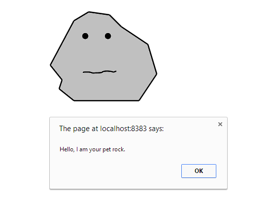

Als de gebruiker voor de eerste keer op het beeldje klikt, wordt via een prompt de naam van de gebruiker opgevraagd.

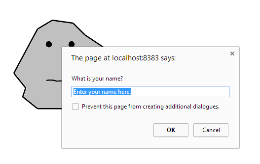

Als de gebruiker zijn naam heeft ingegeven verschijnt een alert "It's good to meet you, *naam_gebruiker*".

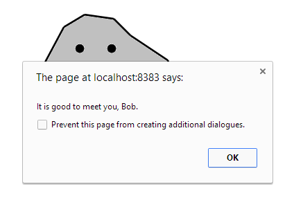

Als er op Pet rock wordt geklikt wanneer de naam van de gebruiker reeds gekend is verschijnt een alert "I like the attention, *naam_gebruiker*. Thank you."

In beide gevallen wordt na de alert het beeldje aangepast in rock_happy.png. Na 2 seconden wordt terug het beeldje rock.png getoond. 

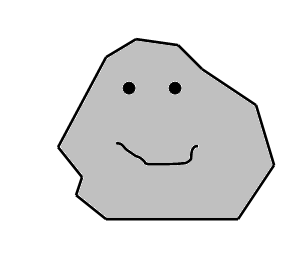

### De opgave
1. Bekijk index.html. Dit bevat een beeldje.
2. Maak een javascript bestand iRock.js aan en verwijs naar dit script bestand in index.html
3. Maak een object myPetRock. Het object heeft een property username (initieel lege string), een property image (initieel ‘images/rock.png’) en een methode resetImage die de property image instelt op de initiële waarde ‘images/rock.png’)

4. Schrijf een functie greetUser. De functie genereert een alert met de tekst ‘Hello I am your pet rock’.

5. Schrijf een functie init. Voorlopig is het enige die gebeurt in deze functie een aanroep naar greetUser.

6. Als het load event van het window object afgevuurd wordt dient de functie init te worden aangeroepen. Stel de event handler in, run de applicatie en ga na of je begroet wordt.

7.	Schrijf een functie touchRock. 

     * Indien de username van myPetRock de lege string is dan zal deze functie via een prompt de naam van de gebruiker opvragen en de property username van myPetRock aanpassen. 
     * Indien de username van myPetRock reeds ingesteld is, wordt een alert "I like the attention, <myPetRock.username>. Thank you." gegeven. 

8.	Pas de init functie aan zodat de functie touchRock als event handler wordt ingesteld voor het click event van het beeldje.

9.	Run de applicatie. Ga na of er gepast gereagreerd wordt als je klikt op de rock.

10.	Schrijf een functie showRock. De functie stelt het src attribuut van het beeldje in op de image property van myPetRock.

11.	Pas de functie touchRock verder aan: na de alerts wordt het beeld voor eventjes aangepast in de happy rock.

    * Verander de waarde van de property image van myPetRock naar ‘images/happyrock.png’

    * Roep showRock aan

    * Roep de methode resetImage aan

    * Maak gebruik van de javascript functie setTimeOut om na twee seconden de functie showRock terug aan te roepen. De functie setTimeout bevat 2 parameters: de naam van de functie die moet worden uitgevoerd na afloop van de timer, en de timertijd in ms. setTimeout(showRock, 2 * 1000);

12.	Run de applicatie en bekijk het resultaat

## Oefening 3 - Scrabble
### Omschrijving van de pagina
De webpagina bevat een tekstveld en een knop Bereken waarde. Bij het klikken op de knop wordt de punten voor dit  woord berekend en geretourneerd in een alert. 

De waarden van de letters zijn als volgt :
a:1, b:3, c:5, d:1, e:1, f:4, g:3, h:4, i:1,j:4, k:3, l:3, m:3, n:1, o:1, p:3, q:10, r:2, s:2, t:2, u:4, v:4, w:5,x:8, y:8, z:4

Het woord javascript bvb levert 25 punten op.

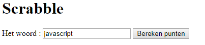

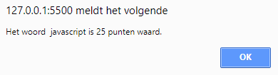

### De opgave
1. Declareer in scrabble.js een variabele letterwaarden. Letterwaarden is een object  en bevat een property voor elke letter in het alfabet. De waarde van de property is het aantal punten voor deze letter.
2. Declareer een functie berekenPunten die een woord als parameter doorkrijgt en de punten voor dit woord berekent en retourneert
3. Declareer een functie init, die ervoor zal zorgen dat wanneer de gebruiker op de knop "Bereken punten" klikt de alert verschijnt. Maak gebruik van document.getElementById(“ … “) om de knop en het tekstvak te kunnen gebruiken in de JavaScript code.  
4. Roep de functie init aan als het venster geladen is.

## Oefening 4 - Craps
### Omschrijving van de pagina
Dit  dobbelsteenspel wordt gespeeld met twee dobbelstenen. Het spel vraagt eerst hoeveel de gebruiker (shooter) wil inzetten. 

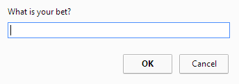

De shooter geeft zijn inzet in. Vervolgens verschijnt de alert

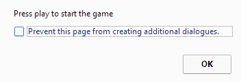

De dobbelstenen worden gegooid. Is de uitkomst op de eerste worp 11 of 7, dan wordt zijn inzet 2 maal uitbetaald. Werpt de shooter iets anders,  dan wordt dat zijn punt (point) en moet hij zorgen dat hij dit punt nogmaals gooit, voordat hij een 11 of een 7 gooit. Hij werpt net zolang, totdat hij zijn punt maakt of een 7 of 11 gooit. Gooit de shooter  nogmaals zijn punt krijgt hij zijn inzet terug. Gooit hij terug een 7 of 11 dan verliest de shooter zijn inzet. 

Hieronder enkele voorbeelden van alerts na het rollen van de dobbelstenen :

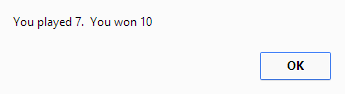

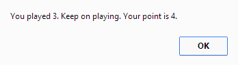

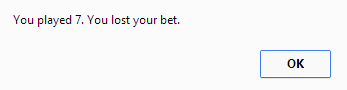

### De opgave
1. Vul craps.js aan. Daar we momenteel nog geen instanties van een klasse kunnen aanmaken, dienen we voor de dobbelstenen 2 objecten aan te maken dice1 en dice2. Beide objecten bevatten dezelfde property en dezelfde functie. dice1 en dice2 hebben beide
    - een property eyes, initieel de waarde 1
    - een methode roll : de dobbelsteen wordt gerold. De nieuwe waarde wordt bijgehouden in de property eyes.
    
2.	Maak een  functie init. Zorg ervoor dat als je op play knop klikt, de 2 dobbelstenen gerold worden en de som van beide via een alert wordt weergegeven. 

3.	Voer de init functie uit als het event load van het window object afgevuurd wordt.

4.	Maak een object craps met de properties
    - bet: de inzet
    - point: ogen van de eerste worp, initieel 0
    - earned: het bedrag dat de shooter gewonnen heeft (initieel 0)
    - gameover: initieel false
    - dices: een array met 2 dobbelstenen dice1 en dice2

5.	Voeg volgende methodes toe aan craps 
    - rollDice: rol de 2 dobbelstenen
    - getSum: retourneert de som van de ogen van de 2 dobbelstenen

6.	Pas de eventhandler voor het click event van de knop play aan. Roep bovenstaande functies op voor het rollen van de dobbelstenen en het weergeven van de som ervan via een alert

7.	Pas de functie init in de module aan zodat de gebruiker bij aanvang gevraagd wordt om zijn inzet: *"What is your bet?"*. Pas de property bet van het craps object aan. Geef vervolgens een alert *"Press play to start the game."*

8.	Voeg de methode play toe aan het object craps. Deze methode rolt de dobbelstenen en past de spelregels toe. Eventueel worden de properties points en/of  gameover en earned aangepast.

9.	Pas de eventhandler voor het click event van de knop play aan. Roep de methode play aan en geef een gepaste alert.
	*"You played " + som van de dobbelstenen.*
Gevolgd door
    Als gameover: *You won ....* of *You lost the game*
    Als de shooter moet verderspelen : *"Keep on playing. Your point is " + craps.point + ".";*

